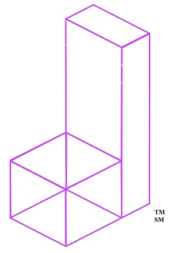

# NOTEBLOCK
A DeMI (Decentralized Music Industry) ecosystem centered around an auctionable non-fungible token.

NoteBlock Tokenizes your music.

NoteBlock lets you license your work using blockchain.

NoteBlock includes a decentralized licensing marketplace.
NoteBlock has built-in charitable contributions to support diversity in the Music Industry.
We have decentralized decision making through governance tokens
We have revenue sharing: all fees are paid out to all governance token holders!

## Webapp Outline
Currently a simple landing page meant to inform newcomers
1. HomePage - outlines products + services + core elements to project, 
2. Auth0 Sign Up 

## Starting State
When this shared space was created, the following was already created and completed by Mark alone:
- Functioning Javascript application using React
- Application hosted on AWS Amplify at Marks expense
- noteblockmusic.com and noteblock.io Google domains that Mark integrated with AWS Amplify were rented at Marks expense
- Link to Medium blog Mark wrote on behalf of Noteblock on function application
- Logos and names created by Mark are seen on functioning application
- Product design, roadmap, products, etc

## TODO - Short Term + low errort
- [x] Authentication research ** Completed by Antony **
- [x] Integrate Auth0 with a Log In/ Sign In button - works on localhost ** Completed by Antony **
- [x] Setup GitHub Pro to require approvals for PRs from forked repo ** Completed and Paid for by Mark **
- [ ] Upgrade components to MaterialUI to reduce complexity + to upgrade look + feel ** WIP by Antony **
- [ ] Upgrade app to typescript to faster development + access to better documented libraries ** WIP by Antony **
- [ ] AWS env variable setup for Auth0 with PROD account ** WIP - Assigned to Mark ** 
- [ ] Side Nav for documentation, white paper, etc ** WIP by Anotny **

## TODO  next priorities:
- [ ] Choose 3rd party for email newsletter
- [ ] Integrate Email Newsletter Sign up
- [ ] Connect to Metamask functionality
- [ ] Functionality dependant on successful authentication (such as connecting to metmask)
- [ ] Sitemap.xml setup for SEO

## Roadmap - i.e. longer term TODOs:
- [ ] Creation of Tokens Page
  - Page will offer "create a token" button which will open an upload modal. A usser ought to be able to upload .mp3, .wav, .fl, and other music file types
  - User will see tiles that represent the tokens they already have created. Tiles will be paginated so that users with > a number, perhaps 10, will have a page 2 etc 
- [ ] Creation of Auctions page
- [ ] Creation of Licensing page
- [ ] Creation of Coin Reservation page for 50 day resevation period
- [ ] Routing for Tokens page, Auctions page, Licensing Page from tabs in the header. Mock up will be provided.
- [ ] POST and GET requests to IPFS for audio file storage
- [ ] Add google analytic code to env variables ** Assigned to Mark **

# Below will be moved into a spreadsheet of some kind. The info is a placeholder

## History:

### Commit History
#### Repo: noteblockcommons/NoteBlockWebApp

### Issue history

## Technical Notes:
